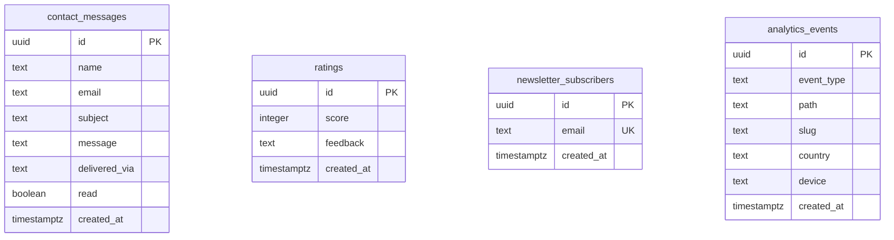

# Database Schema

The database is **Supabase PostgreSQL** (free tier). The schema is owned by
[`backend/supabase/schema.sql`](backend/supabase/schema.sql) — the repo is
the source of truth, the Supabase dashboard is for reading and running that
file, not for hand-editing structure. Setup walkthrough:
[docs/SUPABASE_SETUP.md](docs/SUPABASE_SETUP.md).

## Entity-relationship diagram



There are **no foreign keys between these tables** — each is an
independent log/archive of one kind of visitor action, not a relational
graph. That's deliberate: contact messages, ratings, newsletter signups,
and analytics events don't reference each other or a `users` table (there
is no visitor "account" concept on this site — only the single admin,
authenticated separately via Supabase Auth, outside this schema entirely).

## Tables

### contact_messages

Archive of every contact-form submission (even when email delivery also
succeeded — nothing gets lost).

| Column | Type | Notes |
| --- | --- | --- |
| id | uuid PK | `default gen_random_uuid()` |
| name | text | `check (char_length(name) between 2 and 100)` — mirrors `contactSchema` |
| email | text | `check (char_length(email) <= 150)` |
| subject | text | `check (char_length(subject) <= 150)` |
| message | text | `check (char_length(message) <= 3000)` |
| delivered_via | text | `smtp`, `web3forms`, `none`, or `failed`; `default 'none'` |
| read | boolean | toggled from the admin inbox; `default false` |
| created_at | timestamptz | `default now()` |

### ratings

Visitor portfolio ratings ("Ship readiness review" on the homepage).

| Column | Type | Notes |
| --- | --- | --- |
| id | uuid PK | `default gen_random_uuid()` |
| score | integer | `check (score between 1 and 5)` |
| feedback | text | optional, `check (char_length(feedback) <= 300)` |
| created_at | timestamptz | `default now()` |

### newsletter_subscribers

Footer email signups.

| Column | Type | Notes |
| --- | --- | --- |
| id | uuid PK | `default gen_random_uuid()` |
| email | text | `unique`, `check (char_length(email) <= 150)` — a repeat signup upserts rather than erroring |
| created_at | timestamptz | `default now()` |

### analytics_events

First-party events feeding Portfolio Insights. Deliberately anonymous: no
IPs, no cookies, no fingerprints stored.

| Column | Type | Notes |
| --- | --- | --- |
| id | uuid PK | `default gen_random_uuid()` |
| event_type | text | `page_view`, `resume_download`, `project_view`, `contact_submit`, `rating_submit`, `chat_opened`, `terminal_command` |
| path | text | for page views |
| slug | text | project slug or terminal command name |
| country | text | ISO code from the hosting platform's edge header, when present |
| device | text | `Desktop` / `Mobile` / `Tablet` / `Bot` |
| created_at | timestamptz | `default now()`, indexed with `event_type` |

## Indexes

Only one explicit index beyond the primary keys (which are automatically
indexed as `uuid primary key`):

```sql
create index if not exists analytics_events_type_idx
  on public.analytics_events (event_type, created_at desc);
```

Supports the Insights aggregation query pattern (`GET /api/insights`):
filtering by `event_type` and ordering by recency. No other table has a
query pattern that benefits from an index yet — `contact_messages`,
`ratings`, and `newsletter_subscribers` are all read via `/admin` with
simple `order by created_at desc limit N` scans, small enough at a
portfolio's data volume that an index wouldn't measurably help.

## Row-level security (RLS)

Every table has RLS **enabled with zero policies defined** — deliberate,
not incomplete:

```sql
alter table public.contact_messages enable row level security;
alter table public.ratings enable row level security;
alter table public.newsletter_subscribers enable row level security;
alter table public.analytics_events enable row level security;
```

With RLS on and no policies, Postgres denies **all** access to the `anon`
and `authenticated` roles, full stop — there is nothing to additionally
lock down. Only the Next.js API routes can reach this data, using the
`SUPABASE_SERVICE_ROLE_KEY` (server-only, bypasses RLS entirely). Practical
effect: even if `NEXT_PUBLIC_SUPABASE_ANON_KEY` leaks — it's public by
design, shipped in the browser bundle — it grants zero read/write access
to any table.

Trust chain: **browser → validated & rate-limited API route → service-role
client → database.** The admin authenticates separately through Supabase
Auth (email + password, no custom table); admin API routes verify the
session token *and* that its email matches `ADMIN_EMAIL` before touching
anything (see [API_REFERENCE.md](API_REFERENCE.md#admin-endpoints-authentication-required)).

If you extend this schema with a new table, remember to
`enable row level security` on it too and *not* add public policies unless
you specifically want anonymous read/write access.

## Storage buckets

**Not used.** Certificate images, the resume PDF, and the research paper
PDF are static files under `frontend/public/` (optionally Cloudinary URLs
pasted directly into content files instead — see
[docs/ENVIRONMENT_SETUP.md](docs/ENVIRONMENT_SETUP.md#variables-removed-from-this-project)).
No bucket setup is required for this project to work.

## Migration strategy

There's no migration framework (no Prisma/Drizzle/Supabase CLI migrations
directory) — `schema.sql` is written to be **idempotent** and re-run in
full:

```sql
create table if not exists ...
create index if not exists ...
alter table ... enable row level security;   -- safe to re-run
```

To change the schema:

1. Edit `backend/supabase/schema.sql` directly, keeping every statement
   `if not exists`/`or replace` so the whole file stays safely re-runnable.
2. Paste the full file into the Supabase SQL Editor and run it again — new
   statements apply, statements for things that already exist are no-ops.
3. Update `shared/types.ts` if the change affects an API payload shape.
4. Update the API route(s) that read/write the changed table.
5. Update this document and [API_REFERENCE.md](API_REFERENCE.md) together
   with the code change, not after.

This works well at this project's scale (a handful of simple tables, one
deployment environment) but doesn't track schema *history* — there's no
record of what the schema looked like at a past point in time beyond git
history on `schema.sql` itself. That's an acceptable trade-off here, not a
gap to fix reflexively; introducing a migration tool would be new
infrastructure for a project that doesn't have multiple environments or
collaborators to synchronize.

## Useful queries (SQL Editor)

```sql
-- Unread messages
select created_at, name, subject from contact_messages
where read = false order by created_at desc;

-- Rating summary
select round(avg(score), 2) as average, count(*) from ratings;

-- Views per day, last 14 days
select date_trunc('day', created_at) as day, count(*)
from analytics_events where event_type = 'page_view'
group by 1 order by 1 desc limit 14;

-- Reset analytics / test data
truncate analytics_events;
truncate ratings;
```
